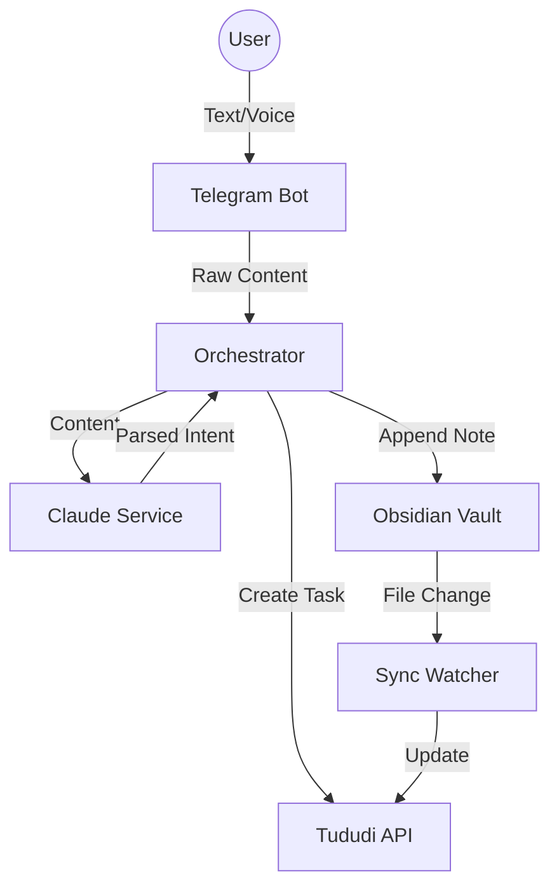

# Architecture

## System Overview
Remembro-Tududi is an orchestration layer that connects:
1.  **Input Channel:** Telegram (Text & Voice)
2.  **Intelligence:** LLM (Claude) for Intent Understanding & Parsing
3.  **Storage/Action:**
    - **Tududi:** Task Management API
    - **Obsidian:** Local Markdown Files (Knowledge Base/Daily Notes)

## Components

### 1. Telegram Bot Service (`src/bot`)
- Handles incoming webhook/polling events.
- Manages voice file downloads for transcription.
- Sends responses back to user.

### 2. Orchestrator (`src/orchestrator.js`)
- Central hub routing messages.
- Flow: `Message -> Orchestrator -> LLM -> Intent -> Action (Tududi/Obsidian)`.

### 3. LLM Middleware (`src/llm`)
- **Task Parser:** Extracts task details (name, due date, project) from natural language.
- **Prompt Engineering:** specialized prompts for daily planning vs task capture.

### 4. Tududi Client (`src/tududi`)
- HTTP Client wrapper for Tududi API.
- Handles authentication and error states.

### 5. Obsidian Manager (`src/obsidian`)
- **File Manager:** Manipulates local markdown files.
- **Sync Watcher:** Uses `chokidar` to listen for file changes in Obsidian vault to push back to system.

## Data Flow

## Tech Stack
- **Runtime:** Node.js
- **Framework:** Custom (No heavy framework like NestJS, using focused modules)
- **Dependencies:**
    - `node-telegram-bot-api`
    - `@anthropic-ai/sdk`
    - `chokidar` (File watching)
    - `dotenv` (Config)
